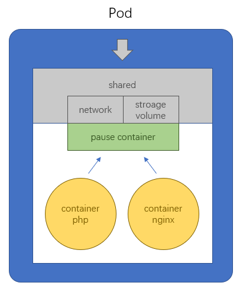
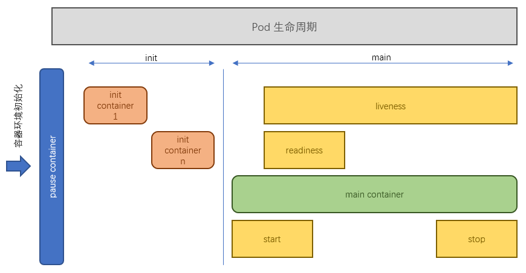
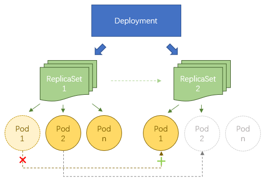
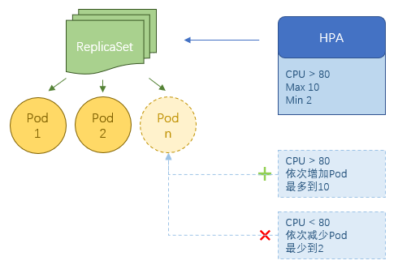

## Kubernetes
=====
#### Pod
+ Pod 原理

+ Pod 生命周期

> + Pod 能够具有多个容器，允许有一个或多个先于它启动的 Init 容器
> + Init 容器总是运行到成功完成为止，每个 Init 容器都必须在下一个 Init 容器启动之前成功完成
> + 如果 Init 容器失败，k8s 会不断重启该 Pod，直到 Init 容器成功为止，如果 Pod 的 restartPolicy 为 Never，则不会重新启动

#### 控制器
##### ReplicaSet & Deployment (ReplicationController)
* ReplicaSet：
> * 确保容器副本数始终保持在用户定义的副本数，如果容器异常退出会自动创建新Pod替代，多出的容器会自动回收
> * 可以独立使用，但建议使用 Deployment 来自动管理 ReplicaSet（ReplicatSet 不支持 rolling-update，Deployment 支持）

* ReplicationController:
> * 旧版，与 ReplicaSet 本质一样，但不支持集合式的 selector

* 用 Deployment 控制 ReplicaSet 更新（可回退）

> * 先创建 ReplicaSet2，在 ReplicaSet2 上创建 Pod1 然后再释放 ReplicaSet1 中 Pod1，依次类推完成升级
> * ReplicaSet2 中所有 Pod 创建完满足要求后会停用 ReplicaSet1（不是删除），回滚时和升级过程反向
>

##### HPA(HorizontalPodAutoScale)

> * HPA 仅适用于 Deployment 和 ReplicaSet
> * v1 版本中仅支持根据 Pod 的 CPU 利用率扩缩容，v1alpha 版本中支持根据内存和用户自定义 metric 扩缩容

+ StatefulSet

+ DaemonSet

+ Job CoreJob

-----
# 集群资源分类
+ 名称空间级别：
> + 工作负载型资源（workload）: Pod、ReplicaSet（ReplicationController）、Deployment、DaemonSet、Job、CronJob
> + 服务发现及负载均衡型资源（ServiceDiscovery LoadBalance）：Service、Ingress、...
> + 配置与存储型资源：Volume（存储卷）、CSI（容器存储接口，可以扩展各种第三方存储卷）
> + 特殊类型的存储卷：ConfigMap（当配置中心来使用的资源）、Secret（保存敏感数据）、DownwardAPI（把外部环境中的信息输出给容器）

+ 集群级别：
> + Namespace、Node、Role、ClusterRole、RoleBinding、ClusterRoleBinding

+ 元数据级别：
> + HPA、PodTemplate、LimitRange

-----
#命令

+ kubectl --help // 帮助

+ kubectl explain pod // 查看 pod 模板用法

+ kubectl expose --help // 看 expose 帮助

+ kubectl log <pod name> -c <container name> // 查看 pod 中指定容器的日志

+ kubectl describe pod <pod name> // 查看 pod 详细信息

+ kubectl run nginx-deployment --image=nginx --port=80 --replicas=1 // 创建 Pod

+ kubectl get deployment

+ kubectl get rs

+ kubectl get pod -o wide

+ kubectl delete pod <pod name>

+ kubectl scale --replicas=3 deployment/nginx-deployment // 扩容

+ kubectl expose --help

+ kubectl get svc

+ kubectl expose deployment nginx-deployment --port=80 --target-port=8080 // 创建 Service

